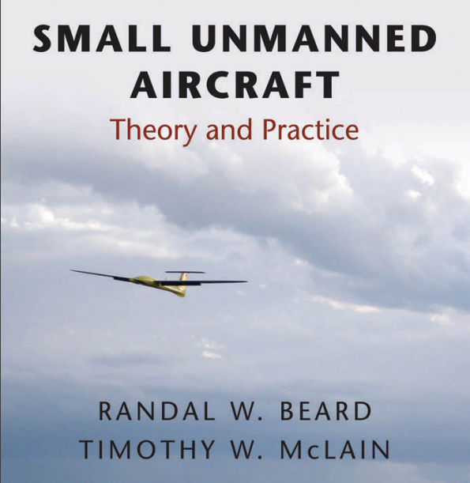
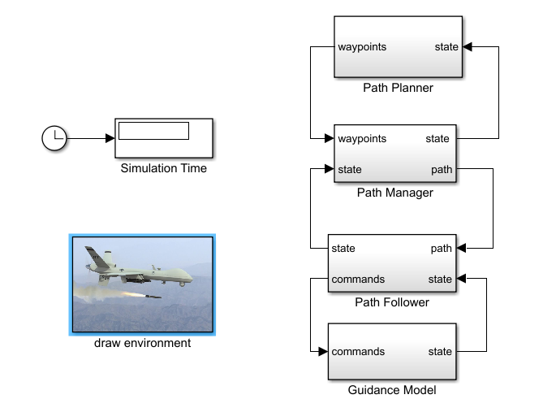
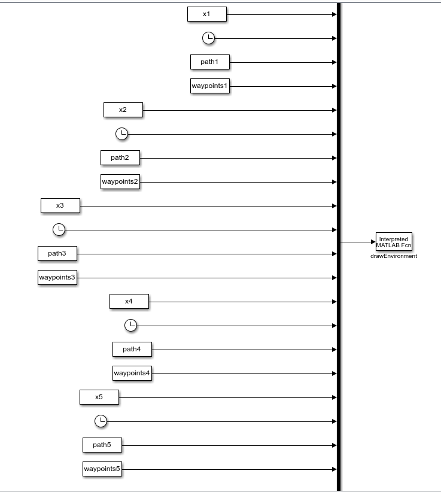

# Multiple fixed-wing UAVs flight simulation platform


## 1. Introduction

A multiple fixed-wing UAVs flight simulation platform built by matlab and simulink.

## [传送门->中文的说明](READMEch.md)

The example given here has 5 UAVs, but of course you can expand it to 10, 20 or even more if you are willing to take the time.

Input: The path of all uavs 

Output: 13 state quantities per drone per moment
    
    pn1            % inertial Northposition     
    pe1            % inertial East position
    pd1            % inertial Down position
    u1             % body frame velocities
    v1              
    w1            
    phi1           % roll angle         
    theta1         % pitch angle     
    psi1           % yaw angle     
    p1             % roll rate
    q1             % pitch rate     
    r1             % yaw rate    
    t1             % time


---

## 2. The original intention of platform building

Recently, there is a need to extend the algorithm of cooperative control to fixed-wing UAVs, but the cooperative control algorithm generally considers first-order and second-order integrators or a bicycle model. Even if a fixed-wing model is considered, it is only a simple fixed-wing dynamics model.

But the real fixed-wing UAV flight control model is very complex and has strong nonlinearity.
So how to prove that my proposed fixed-wing cooperative control algorithm, or planning algorithm is effective. 
You know strict mathematical proof is very difficult, but it can be proven to work well in engineering.
At this point, it is necessary to use a more realistic fixed-wing flight control model to simulate the real UAV flight state. This is the reason why I built this platform.

In fact, Matlab has a simulation tool for fixed-wing UAVs( [Matlab fixed-wing UAV tool ](https://ww2.mathworks.cn/help/uav/ref/fixedwing.html
)), but the official documentation is small, and it is not very convenient to use, and the animation display can only show one aircraft. In short, it is not good enough.


The code mainly refers to Randal's "Small Unmanned Aircraft Theory and Practice", which the flight control principle used in code I hardly understand. My job is to integrate them and  show them inside one screen. As a person who does planning, you don't have to figure out all the underlying control principles.



---

## 3. How to use 

The simulation platform can be divided into two parts, one is the calculation part 'uavA1' and the other is the display part 'uavShow'. 

Just run the main.m file directly.

In fact, you can also synchronize the calculation and display, real-time calculation and then display. But personally, I think this will affect the smoothness of the display.  The more aircraft the greater the impact will be.

### 3.1 Calculation part

The state of each aircraft is calculated in turn over time and will be stored in the x1.mat file (x1 can be x2,x3.... which indicates the number of aircraft).

- CalAlluavs.m 



### 3.2 Show part

- ShowAlluavs.m 

The data of each aircraft is stored in x, path, waypoint data. Using all the data, the show part could work.


## 4. How to read path files

The folder 'data' provides some path files for 5 aircraft that can be used.

If you want to calculate your own route data, you can follow these steps.
1. uavA1/getWpp.m     -> load '5jia.mat'
2. uavA1/para_chap1.m -> load '5jia.mat'

Find the corresponding code in the file and change the name of '5jia.mat' .

'getWpp.m'  Read the path

'para_chap1.m' reads the initial position of the aircraft

The simulink time needs to be adjusted according to the length of your path file, if your uav obviously did not run through your path, you need to adjust the time longer.

## 5. How to increase the number of uavs

 How to increase the aircraft is actually very easy but a little bit of boring. You need to add some code and change the corresponding numbers. The steps are as follows.
 
## The steps are as follows:

### 1. main.m
First of all, in the 'main.m' file, you can see that the code statements for each aircraft are obvious, add the corresponding sentences. 


```matlab
%----------------
uavW = 1;
save('uavW.mat','uavW');
sim('New_mavsim_chap12');

ii = 1;
eval(['x' num2str(ii) '= x;'])
eval(['path' num2str(ii) '= path;'])
eval(['waypoints' num2str(ii) '= waypoints;'])

save('x1.mat','x1','path1','waypoints1');
%----------------
clear;
uavW = 2;
uavi = uavW;
save('uavW.mat','uavW');
sim('New_mavsim_chap12');

ii = 2;
eval(['x' num2str(ii) '= x;'])
eval(['path' num2str(ii) '= path;'])
eval(['waypoints' num2str(ii) '= waypoints;'])
save('x2.mat','x2','path2','waypoints2');
%----------------
clear;
uavW = 3;
save('uavW.mat','uavW');
sim('New_mavsim_chap12');

ii = 3;
eval(['x' num2str(ii) '= x;'])
eval(['path' num2str(ii) '= path;'])
eval(['waypoints' num2str(ii) '= waypoints;'])
save('x3.mat','x3','path3','waypoints3');
%----------------
clear;
uavW = 4;

save('uavW.mat','uavW');
sim('New_mavsim_chap12');

ii = 4;
eval(['x' num2str(ii) '= x;'])
eval(['path' num2str(ii) '= path;'])
eval(['waypoints' num2str(ii) '= waypoints;'])
save('x4.mat','x4','path4','waypoints4');
%----------------
clear;
uavW = 5;
save('uavW.mat','uavW');
sim('New_mavsim_chap12');

ii = 5;
eval(['x' num2str(ii) '= x;'])
eval(['path' num2str(ii) '= path;'])
eval(['waypoints' num2str(ii) '= waypoints;'])
save('x5.mat','x5','path5','waypoints5');

```

### 2. uavShow/drawEnvironments5.m

Add the sentence of uavShow/drawEnvironments5.m. The sentence here looks complicated, but you don't have to figure out what it means. Just add it mechanically and change the numbers. 
If you look at the file uavShow/drawEnvironments5.m, you'll see what I'm talking about.

```matlab
%----------------1-----------------------------------
    NN = 0;
    pn1       = uu(1+NN);       % inertial North position     
    pe1       = uu(2+NN);       % inertial East position
    pd1       = uu(3+NN);       % inertial Down position
    u1        = uu(4+NN);       % body frame velocities
    v1        = uu(5+NN);       
    w1        = uu(6+NN);       
    phi1      = uu(7+NN);       % roll angle         
    theta1    = uu(8+NN);       % pitch angle     
    psi1      = uu(9+NN);       % yaw angle     
    p1        = uu(10+NN);      % roll rate
    q1        = uu(11+NN);      % pitch rate     
    r1        = uu(12+NN);      % yaw rate    
    t1        = uu(13+NN);      % time
    
    NN = NN + 13;
    path1     = uu(1+NN:13+NN); 
    NN = NN + 13;
    num_waypoints1 = uu(1+NN);
    waypoints1     = reshape(uu(2+NN:5*num_waypoints1+1+NN),5,num_waypoints1)'; 

    % define persistent variables 
    persistent aircraft_handle1;  % figure handle for MAV
    persistent path_handle1;      % handle for straight-line or orbit path
    persistent waypoint_handle1;  % handle for waypoints
    persistent Faces1
    persistent Vertices1
    persistent facecolors1

```
---

```matlab
[Vertices1,Faces1,facecolors1] = defineAircraftBody(scale);                              
        aircraft_handle1 = drawBody(Vertices1,Faces1,facecolors1,...
                                   pn1,pe1,pd1,phi1,theta1,psi1,...
                                   [], 'normal');
        hold on
        waypoint_handle1 = drawWaypoints(waypoints1, P.R_min, [], 'normal');
        path_handle1 = drawPath(path1, S, [], 'normal');


```

---

```matlab
drawBody(Vertices1,Faces1,facecolors1,...
                     pn1,pe1,pd1,phi1,theta1,psi1,...
                     aircraft_handle1);
        drawWaypoints(waypoints1, P.R_min, waypoint_handle1);
        drawPath(path1, S, path_handle1);
```

### 3.uavShow/mavsim_show.slx

Open the uavShow/mavsim_show.slx file, simply add a few boxes and then just connect them.

For example, if you want to add the sixth uav, add four boxes: x6, time, path6, waypoints6, and then line them up down behind.



--------

### If you think this platform is not bad, please give me a Star or Folk. Thank you.