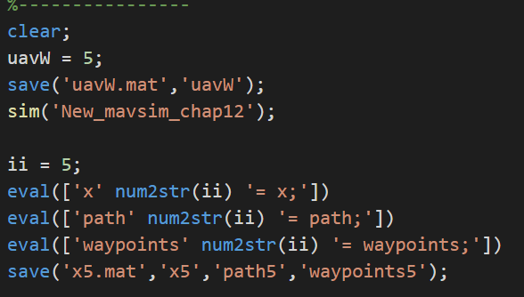
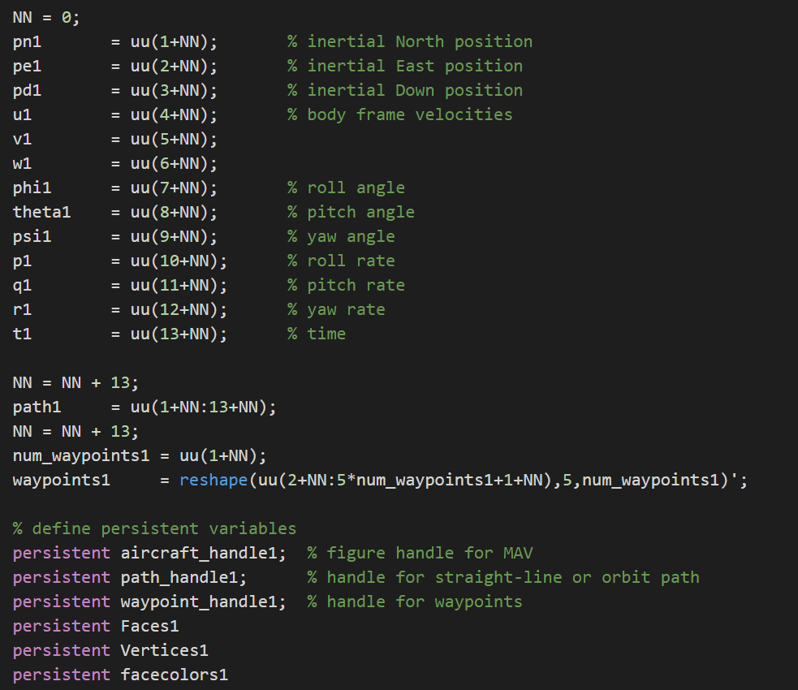
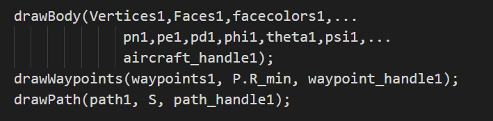

# 集群固定翼无人机飞行仿真平台

## 1.简介

一个小型无人机集群仿真演示平台，使用matlab和simulink搭建。

给出的例子是5架的，当然如果你愿意花时间，也可以把它扩展到10架，20架甚至更多。

输入：5架飞机的规划路径

输出：每架无人机每个时刻的13个状态量

### 13个状态量：

世界坐标系x,y,z方向上的位置

机体坐标系上的速度u,v,w

滚转角，俯仰角，偏航角

滚转角速率，俯仰角速率，偏航角速率

时间

---

## 2.平台搭建的初衷

最近有需要把协同控制的算法扩展到固定翼无人机上的需求，但是协同控制算法一般考虑的都是一阶二阶积分器，单车模型。即使考虑固定翼模型，也只是简单的固定翼动力学模型。

但是真实的固定翼无人机飞控模型是十分复杂的，具有很强的非线性。
那么我怎么证明我提出的固定翼协同控制算法，或者规划算法是有效的呢。此时就需要使用一个较为真实的固定翼飞控来模拟真实的无人机飞行状态。这就是我搭建这个平台的缘由。

其实Matlab是自带一个固定翼无人机的仿真工具的，但是官方给出的文档较少，用起来也不是很方便，动画展示也只能展示一架飞机，总之就是不好用。

搭建的代码主要参考兰德尔的《小型无人机理论与应用》，里面的飞控代码原理我完全不懂，我的工作就是把它们整合起来。并能够在一个画面里面展示多架。

---

## 3.关于怎么使用

仿真平台可以被分为两部分，一块是计算部分uavA1，另一块是展示部分uavShow。直接运行main.m文件就可以了。

其实也可以把计算和展示同步进行，实时的计算然后展示，但是个人认为这样会比较卡，并且飞机越多越卡，会影响展示的流畅程度。

### 3.1 计算部分
我是依次计算每一架飞机的随着时间变化的状态，然后把它们储存在 x1.mat 文件中(x1可以为x2,x3....表示为第几架飞机)。

- CalAlluavs.m 计算部分代码

### 3.2 演示部分

- ShowAlluavs.m 演示部分代码

每一架飞机的数据都储存在x, path, waypoint数据中。 

## 4. 怎么读入路径文件

文件夹data中提供了一些5架飞机的路径文件可以使用。

如果你想计算自己的路径数据，你可以依照下面的步骤：
1. uavA1/getWpp.m     -> load '5jia.mat'
2. uavA1/para_chap1.m -> load '5jia.mat'

找到对应的代码文件中的load,修改'5jia.mat'就行了。

getWpp.m 读取路径

para_chap1.m 读取飞机的初始位置

simulink的时间需要根据你的路径文件的长短调整，如果你的飞机明显没有跑完你的路径，那么你需要把时间调的长一些。

---

## 5. 关于怎么增加飞机

关于怎么增加飞机其实很容易，就是稍微有点麻烦。代码你只需要原封不动的增加，然后改动对应的数字。步骤如下：

### 1.main.m
 首先在main.m文件中,可以看到每架飞机的代码语句是很明显的，增加相应的句子。如下图：

### 2. uavShow/drawEnvironments5.m

增加uavShow/drawEnvironments5.m的句子，这里的句子看似很多很复杂，但是不用搞明白它是什么意思，只需要机械地增加，然后把数字改一下就行。如果你看一下uavShow/drawEnvironments5.m这个文件，你就明白我在说什么了。

---

---

### 3.uavShow/mavsim_show.slx

打开uavShow/mavsim_show.slx文件，简单加几个框框，然后连线就行。

比方说加第六架飞机，那就增加x6，时间，path6，waypoints6 四个框，然后把它们排到后面连线。

